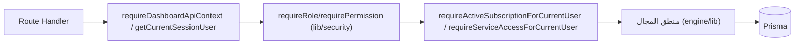

# خريطة مسارات API — API Map

خريطة مسارات API حسب المجال. التفاصيل حسب الوحدة في `api-by-module.md`.

## خارج اللوحات

| المسار | الوظيفة |
|---|---|
| `app/api/auth/{login,logout,register}` | مصادقة |
| `app/api/health` | فحص صحي |
| `app/api/payments/{checkout, moyasar/callback, moyasar/apple-pay/session, webhooks/[provider]}` | دفع |
| `app/api/survey/[token]/submit` | إرسال استبيان عام |
| `app/api/teacher/activity-assignment/[token]/submit` | إرسال مهمة نشاط |
| `app/api/admin/report-templates/workflow-fields` | حقول سير العمل لقوالب التقارير |
| `app/api/admin/workflows/guardian-summons` | بذر قالب استدعاء ولي الأمر |
| `app/api/dev/*` | مسارات تطوير (محلية) |
| `app/api/runtime-check` | فحص تشغيلي |

## لوحات `app/api/dashboard/*` (35)

| المجموعة | الوظيفة |
|---|---|
| `account` | حساب المستخدم |
| `activity-leader` | مهام النشاط + مراجعات + تقارير |
| `admin` | إدارة المنصة (users, subscriptions, activations, payments, workflows, ...) |
| `ai-report` / `ai-report2` | توليد تقارير بالذكاء الاصطناعي |
| `assessment-center` | تحليل تقييمات + تدخلات |
| `calendar` | تذكيرات |
| `cases` | حالات (save-draft, submit, [caseId], autosave) |
| `certificates` | شهادات + دفعات + تصدير |
| `counselor-reference-library` | مكتبة مرجعية |
| `custom-report` | تقارير مخصصة (entries, suggest, templates) |
| `data-center` | استيراد طلاب (noor-import, student-data-import, students) |
| `evidence` | رفع أدلة |
| `family-school-communication` | تواصل أسري + استدعاءات ولي الأمر + تصدير |
| `onboarding` | إعداد الحساب |
| `plans` | خطط واشتراكات المدرسة |
| `portfolio` | محفظة المعلم |
| `principal` | لوحة المدير |
| `report` / `reports` | نظام GuidanceReport القديم |
| `report-1` | توليد تقارير الجيل الأول |
| `report-2` | التقرير الحي (save, approve, export/pdf, snapshots) |
| `report-templates` | قوالب التقارير |
| `resource-links` | روابط متعددة الأشكال (DashboardResourceLink) |
| `results-analysis` | تحليل نتائج |
| `school-data` | بيانات مدرسية (استيراد قديم) |
| `settings` | إعدادات المدرسة |
| `special-report` | تقارير خاصة (ai, runtime, templates) |
| `statistics` | تقارير إحصائية |
| `student-follow-up` | متابعة طلاب |
| `students` | CRUD طلاب + بحث |
| `subscription` | اشتراك المدرسة (نظرة، bank-transfer, redeem-code) |
| `surveys` | استبيانات |
| `timetable-v2` | الجدول المدرسي v2 |
| `workflow-builder` | منشئ سير العمل القديم (شبه معطّل) |

## صيغة عامة لمسار محمي

## ملاحظات
- `report/*` مجرد shims إلى `reports/*`.
- لا توجد مسارات `services/*` تحت `dashboard/api` سوى إحصائيات الخدمات.
- مسار `cases/autosave` وهمي (M6).
- قائمة مسارات كل وحدة في `api-by-module.md`.
