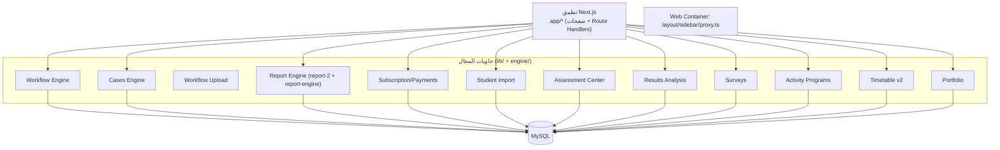

# مخطط الحاويات — Containers

تحليل المنصة إلى حاويات منطقية داخل التطبيق الواحد (single Next.js app).

## الحاويات

| الحاوية | المسار | المسؤولية |
|---|---|---|
| تطبيق الويب (Next.js) | `app/*` | تقديم الصفحات + واجهات API (Route Handlers) |
| محرك سير العمل | `engine/runtime/` + `lib/workflows/` | تحميل سير العمل النشط، ترتيب، شرطية |
| محرك الحالات | `engine/cases/` + `lib/cases/` | حفظ/تحديث `CaseEntry` و`CaseValue` و`Evidence` |
| محرك رفع سير العمل | `engine/workflow-upload/` + `lib/workflow-upload/` | تحليل Excel إلى Workflow/Steps/Fields |
| محرك التقارير | `lib/report-engine/` + `lib/report-2/` + `components/report-2/` | بناء، حفظ، اعتماد، لقطات، تصدير |
| محرك الاشتراكات | `lib/subscription/` + `lib/payments/` + `lib/activation/` | خطط، وصول خدمات، دفع، تفعيل |
| محرك استيراد الطلاب | `lib/noor-import/` + `lib/data-center/` | Excel → `StudentImport*` → طلاب |
| محرك التقييمات | `lib/assessment-center/` + `engine/assessment-center/` | تحليل Excel، ربط طلاب، تدخلات |
| محرك النتائج | `lib/results-analysis/` + `engine/results-analysis/` | تحليل نتائج دراسية، CSV |
| محرك الاستبيانات | `lib/surveys/` | إنشاء، نشر، تحليل، روابط عامة |
| محرك النشاط | `lib/activity-programs/` | مهام معلمين، روابط عامة، تقارير |
| محرك الجدول المدرسي v2 | `lib/timetable-v2/` | مشاريع، قيود (27)، توليد محلي، مراجعة |
| محرك المحفظة | `lib/portfolio/` | لقطات إنجاز المعلم |
| الواجهة العامة للدفع | `app/api/payments/*` | بوابة Moyasar |

## مخطط الحاويات

## اعتماديات مهمة بين الحاويات

- `ACT` يعتمد على `CE` — اعتماد مهمة نشاط يُنشئ `CaseEntry` عبر `saveRuntimeCase`.
- `AE` و`SUR` و`RA` يمكن أن تولّد حالات عبر `CE` (تدخلات التقييم، استبيانات خاصة، تقارير مخصصة).
- `RE` يعتمد على `WE` — لقطة سير العمل في `CaseEntry.workflowSnapshot` تُقرأ من التقارير.
- `TTV2` مستقل عن باقي المجال (نموذج بيانات منفصل `Timetable*`).
- `SE` يشغّل فحص الوصول قبل دخول معظم وحدات اللوحات (`requireServiceAccessForCurrentUser`).
