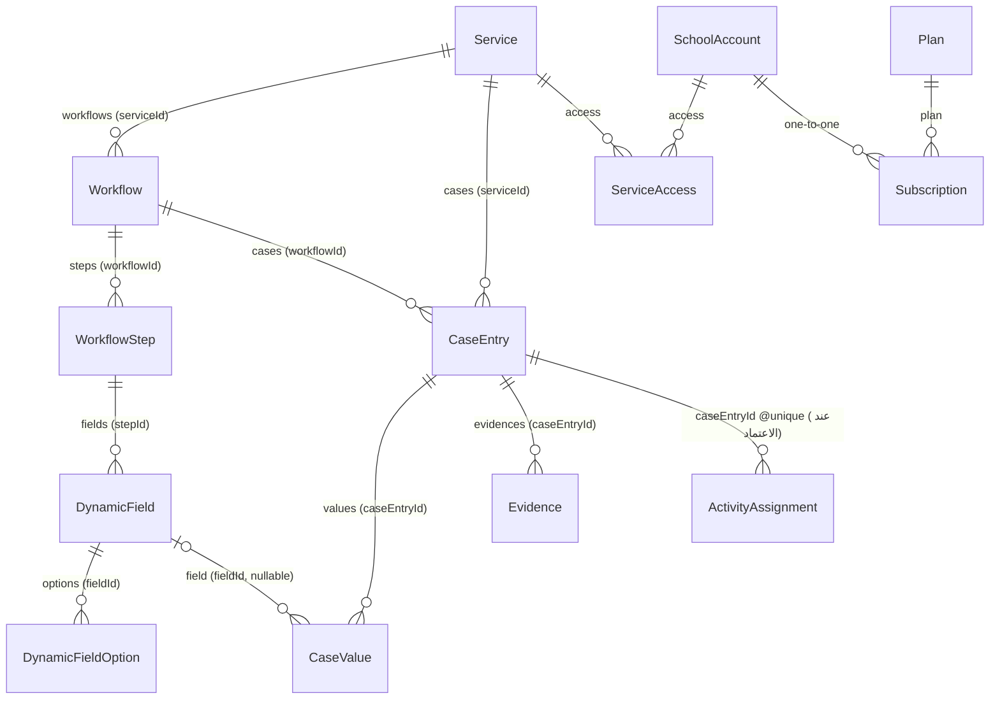
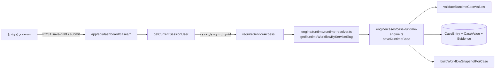

# خريطة الاعتماديات — Dependency Map

علاقات القراءة/الكتابة بين مكونات النظام الرئيسية، مشتقة من الاستخدام الفعلي.

## نواة الاعتماد: `Service → Workflow → WorkflowStep → DynamicField → DynamicFieldOption`

## الاعتماديات عبر الوحدات

| المعتمد | على | العلاقة |
|---|---|---|
| `engine/cases` | `lib/workflows` | لقطة سير العمل عند الإدخال (`workflowSnapshot`) |
| `lib/report-2` | `engine/cases` | يقرأ حالة + قيم لبناء التقرير (`syncReportTwoFromCase`) |
| `lib/report-engine` | `lib/report-2` | المكوّنات الحية (design-renderers، smart-layout) تُستهلك من الاستوديو |
| `lib/assessment-center` | `engine/cases` | `interventions/create-case` ينشئ حالة بقيم `assessment_*` |
| `lib/activity-programs` | `engine/cases` | اعتماد المهمة ينشئ حالة بـ`saveRuntimeCase` |
| `lib/statistics` | `lib/reports` | يقرأ `guidanceReport` + `reportSnapshot` كمصادر |
| `lib/subscription` | `lib/services` | `syncSchoolServicesFromPlan` يكتب `ServiceAccess` من ميزات الخطة |
| `lib/admin` | `lib/subscription` + `lib/payments` | إدارة المستخدمين/الخطط/المدفوعات/الإنفويسات |
| `lib/surveys` | `lib/cases` | استبيان خاص يمكنه توليد حالة (غير مثبت بالكامل) |
| `lib/custom-report` | `engine/cases` | إنشاء حالة تحت خدمة `custom-report` |

## تدفق التحكم الرئيسي لطلب عمل (workflow runtime)

## ملاحظات

- `CaseValue.fieldId` اختياري وغالبًا غير مُعيّن — العرض يعتمد على `fieldKey` (انظر `workflow-display-value.ts`).
- نماذج `UsageLimit` و`UsageRecord` غير مستخدمة في كود TypeScript إطلاقًا.
- `AssessmentInterventionWorkflowTarget` معرّف في الـ schema لكن غير مستخدم في مسارات التدخلات.
- `CustomReportEntry` معرّف لكن قراءة القوائم تتم من `CaseEntry` فعلًا.
