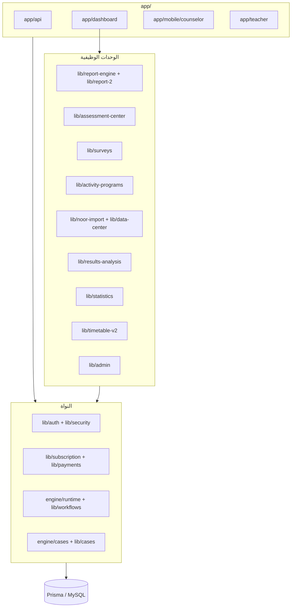

# خريطة الوحدات — Modules

تقسيم الكود إلى وحدات باسم المسارات الحقيقية، مع ما تستورده وتصدّره تقريبًا.

## المجلدات الرئيسية

| المجلد | الوحدة |
|---|---|
| `app/` | التوجيه (صفحات + API) — الجذر مباشرة، لا يوجد مجلد `(group)` |
| `lib/` | منطق المجال، 54 مجلدًا |
| `engine/` | محركات تنفيذية (runtime، cases، upload، validation...) |
| `components/` | مكوّنات React، 58 مجلدًا |
| `prisma/` | النموذج الوحيد `schema.prisma` |
| `app/api/dashboard/` | واجهات اللوحات، 35 مجلدًا |

## خريطة تبعيات الوحدات

## تفاصيل النواة

### المصادقة — `lib/auth` + `lib/security`
- `session.ts` (إنشاء/تحقق كعكة الجلسة)، `current-user.ts` (`getCurrentSessionUser`)، `require-auth.ts`، `session-policy.ts`، `password.ts` (PBKDF2)، `auth-rate-limit.ts`، `dashboard-context.ts`، `dashboard-redirects.ts`، `official-feature-guard.ts`، `public-registration-*`.
- `lib/security/` — طبقة قديمة: `auth.ts` (`getCurrentUser`)، `guards.ts`، `permissions.ts`، `roles.ts`، `rate-limit.ts`.

### الاشتراكات — `lib/subscription`
- `subscription-service.ts`، `subscription-guard.ts`، `subscription-api-guard.ts`، `plan-audience.ts`، `default-free-plan.ts`.

### محرك سير العمل — `engine/runtime` + `lib/workflows`
- `runtime-resolver.ts`، `workflow-conditional-logic.ts`، `field-dependency-engine.ts`.
- `lib/workflows/active-workflow-resolver.ts` (`buildActiveWorkflowSlotQuery`)، `workflow-activation-service.ts`.

### محرك الحالات — `engine/cases` + `lib/cases`
- `case-runtime-engine.ts` (`saveRuntimeCase`، `updateRuntimeCase`)، `lib/cases/case-values.ts`، `lib/cases/resolve-arabic-case-report-title.ts`.

## وحدات أفقية

- `lib/storage/` — تخزين الملفات الأصلية (سير العمل، الاستيرادات).
- `lib/ai/` — عملاء ذكاء اصطناعي (DeepSeek): `deepseek-client.ts`.
- `lib/print-export/` — أدوات تنزيل/طباعة من جهة العميل.
- `lib/http/` و`lib/constants/` و`lib/design/` — مشتركات.

## ملاحظات

- حدود الوحدات غير محكمة: `engine/` يستورد من `lib/` والعكس، والواجهات تصل إلى `@/bin/require-auth` مباشرة من بعض المسارات (انظر `architecture/known-inconsistencies.md`).
- توجد نسخ قديمة كاملة: `lib/report-engine-legacy/` و`lib/reports-legacy/` و`components/reports-legacy/` (كود ميت).
