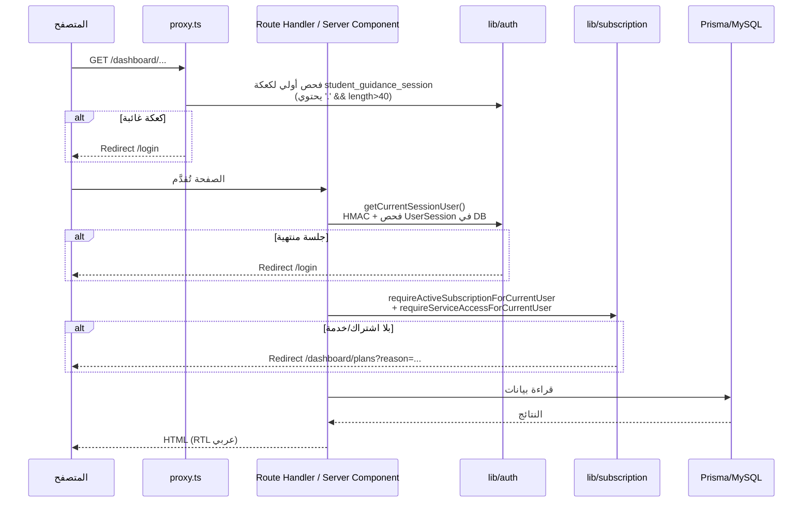
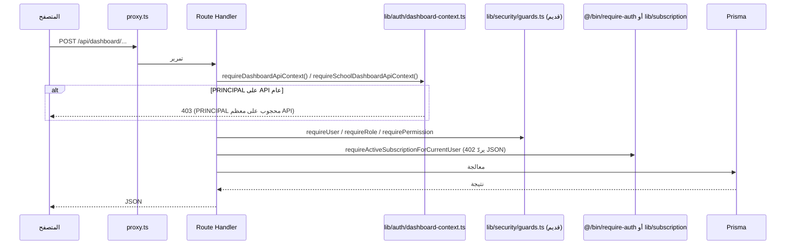
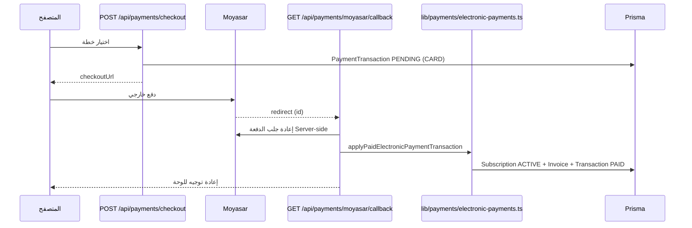

# دورة حياة الطلب — Request Lifecycle

كيف ينتقل الطلب من المتصفح إلى قاعدة البيانات ثم يعود، مع نقاط الحراسة.

## 1) طلب صفحة داخل `/dashboard/*`

## 2) طلب API ضمن `app/api/dashboard/*`

## 3) حراسة وصول الخدمة (خدمة إرشادية)

1. `getRuntimeWorkflowByServiceSlug(slug)` في `engine/runtime/runtime-resolver.ts`:
   - يبحث عن `Service` ثم `Workflow` النشط عبر `buildActiveWorkflowSlotQuery` (`lib/workflows/active-workflow-resolver.ts`).
   - الشروط: `workflow.isActive = true` + `status = ACTIVE` + (`activeKey` مطابق **أو** `workflowType` اسم مستعار للفتحة).
   - يبني `RuntimeWorkflow/RuntimeStep/RuntimeField/RuntimeOption` ثم `sortRuntimeWorkflow` و`normalizeConditionalWorkflow`.

2. عند الحفظ: `validateRuntimeCaseValues` في `engine/cases/case-runtime-engine.ts` يتحقق من القيم مقابل لقطة سير العمل.

## 4) تدفق الدفع (Moyasar)

## ملاحظات

- `proxy.ts` لا يتحقق تشفيريًا من الكعكة — الفحص الحقيقي داخل الصفحات/API عبر `getCurrentSessionUser`.
- مسار `/reset-password` ليس ضمن `PUBLIC_PATHS` في `proxy.ts` لكنه غير مطابق للـ matcher أصلًا.
- مسارات `app/api/dashboard/report/*` مجرد shims تعيد التوجيه إلى `reports/*`.
