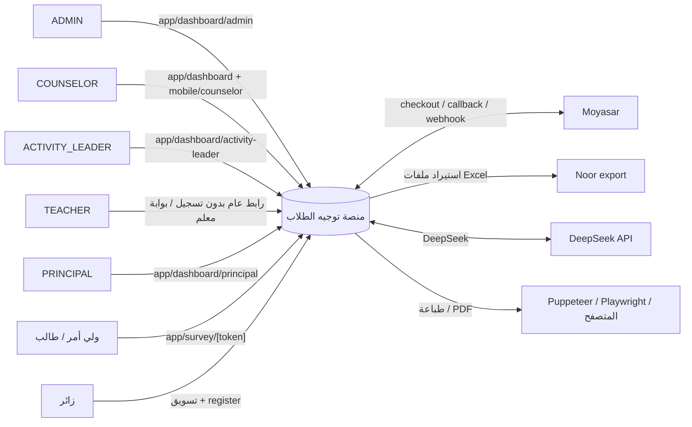

# سياق النظام — System Context

منظور خارجي للمنصة: من يتفاعل معها ومتى، دون تفاصيل داخلية.

## الجهات الفاعلة

| الجهة | الدور | السطح |
|---|---|---|
| المسؤول (ADMIN) | إدارة المدارس والمستخدمين والخطط والمدفوعات وسير العمل والقوالب | `app/dashboard/admin` |
| المرشد (COUNSELOR) | إنشاء حالات، تعبئة سير عمل، إصدار تقارير، مراجعة مكتبة مرجعية | `app/dashboard` + `app/mobile/counselor` |
| قائد النشاط (ACTIVITY_LEADER) | إنشاء مهام نشاط للمعلمين، مراجعة، تقارير | `app/dashboard/activity-leader` |
| المعلم (TEACHER) | تنفيذ مهام النشاط عبر رابط عام بدون تسجيل، بوابة معلم | `app/teacher/activity-assignment/[token]` + `app/dashboard/teacher` |
| مدير المدرسة (PRINCIPAL) | لوحة مدرسية، تقارير | `app/dashboard/principal` |
| ولي الأمر / الطالب (غير مسجّل) | تعبئة استبيان عبر رابط عام | `app/survey/[token]` |
| الزائر | صفحات تسويقية وتسجيل | `app/services`، `app/pricing`، `app/register` |
| بوابة الدفع Moyasar | إنشاء جلسة دفع، ردّ (callback)، ويب هوك | `app/api/payments/*` |
| نظام Noor (تصدير بيانات سعودي) | ملفات Excel للطلاب تُستورد يدويًا | `lib/noor-import` |
| محرك الذكاء الاصطناعي DeepSeek | تحليل نتائج، توصيات، توليد تقارير إحصائية | `lib/ai/deepseek-client.ts` |

## مخطط السياق

## الملاحظات

- المعلم الذي ينفّذ مهمة نشاط **لا يحتاج تسجيل دخول** — الاعتماد على `ActivityAssignment.token` الفريد (انظر `flows/activity-assignment.md`).
- الاستبيان العام يعمل بدون جلسة؛ التفعيل عبر `Survey.token`.
- لا يوجد تكامل Noor مباشر (API) — الاستيراد عبر ملفات Excel يدويًا (`lib/noor/excel-parser.ts`).
- واجهات الدفع: إنشاء `checkout`، رد `moyasar/callback`، و`webhooks/[provider]`.
