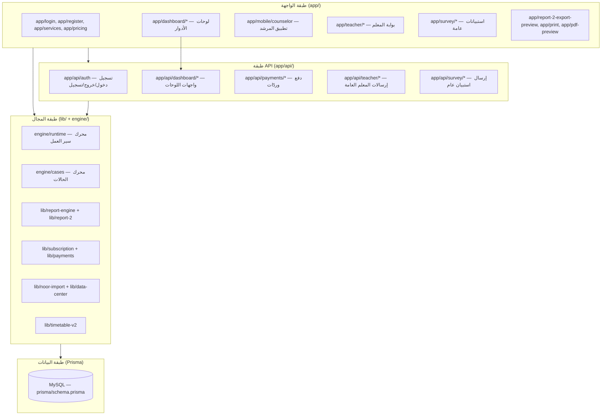

# نظرة عامة على النظام — System Overview

منصة توجيه طلاب (إرشاد مدرسي) عربية RTL تستضيف المدرسة والمرشد والأنشطة الطلابية، مبنية كتطبيق Next.js واحد (monolith) مع قاعدة MySQL.

## الركائز الأساسية

1. **الخدمات الديناميكية** (`Service`) — كل خدمة إرشادية (برامج إرشادية، متابعة طلاب، استدعاء ولي أمر، اجتماعات لجان، تواصل أسري، خدمات توجيه، مؤشرات تقييم) تملك **سير عمل نشطًا واحدًا** (`Workflow`).
2. **محرك سير العمل** (`engine/runtime` + `lib/workflows`) — يعرّف خطوات (`WorkflowStep`) وحقولًا (`DynamicField`) بمستوياتها وقوائم خياراتها (`DynamicFieldOption`)، مع إظهار شرطي وتصفية خيارات.
3. **الحالات** (`CaseEntry` + `CaseValue` + `Evidence`) — كل حفلة إدخال تُحفظ كـ "حالة" تحت ملكية مدرسة، مع لقطة (`workflowSnapshot`) لسير العمل وقت الإدخال.
4. **نظام التقارير من الجيل الثاني** (`report-2` + `lib/report-engine`) — محرّر استوديو، لقطات موافق عليها (`ReportSnapshot`)، تصدير PDF عبر طباعة المتصفح/Playwright.
5. **الاشتراكات والفوترة** — خطط (`Plan`) تملك خدمات (`ServiceAccess`)، اشتراك واحد لكل مدرسة (`Subscription`)، دفعات عبر Moyasar/تحويل بنكي/تفعيل يدوي/أكواد تفعيل.

## الطبقات

## مبادئ عامة اكتُشفت من الكود

- **Guard في الدوال + في الصفحات**: حراسة الموارد مكرّرة على مستويين — `lib/auth/current-user.ts` للجلسة، و`lib/subscription/*` للاشتراك، و`lib/security/*` للصلاحيات (طبقة قديمة ما زالت مستخدمة).
- **مسارات متوازية متعددة**: نظامان لحفظ سير العمل (توليد JSON + رفع Excel)، ونظامان للحالات/الأدلة (`Evidence` و`CaseEvidence`)، وأجيال متعددة من التقارير.
- **محرك واحد متعدد الاستخدامات**: `engine/cases/case-runtime-engine.ts` يُستخدم لتوليد حالات التقييمات والاستبيانات والتقارير المخصصة وحالات النشاط المعتمدة.

## حدود معرفية

- لا يوجد `README` جذر أصلي سوى هذه الوثائق؛ تاريخ القرارات غير موثق في المستودع.
- مجلدات `lib/report-engine-legacy` و`lib/reports-legacy` كود ميت غير مستورد.
