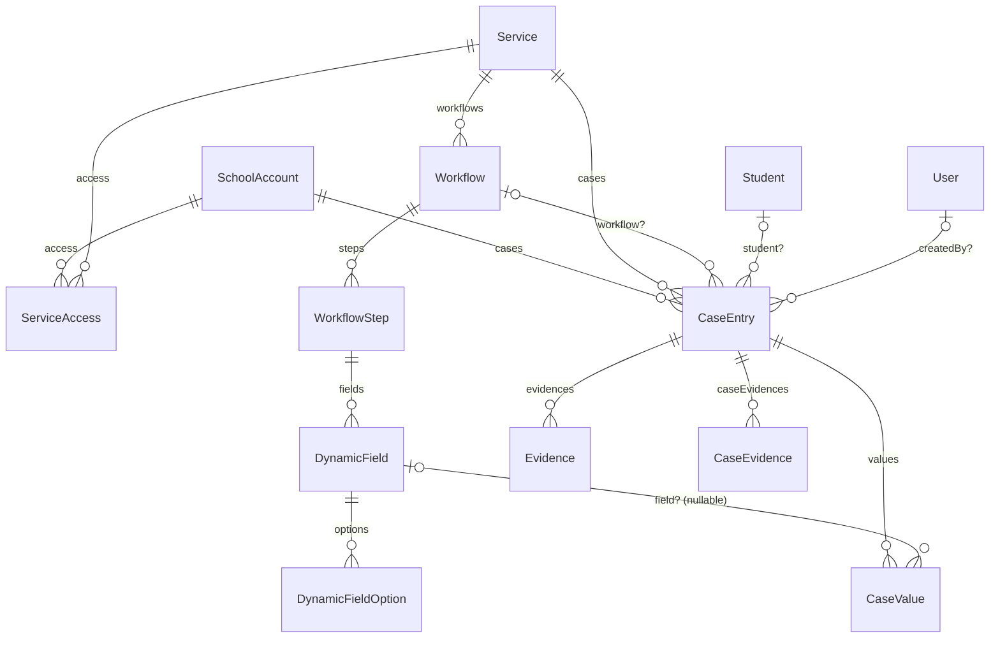
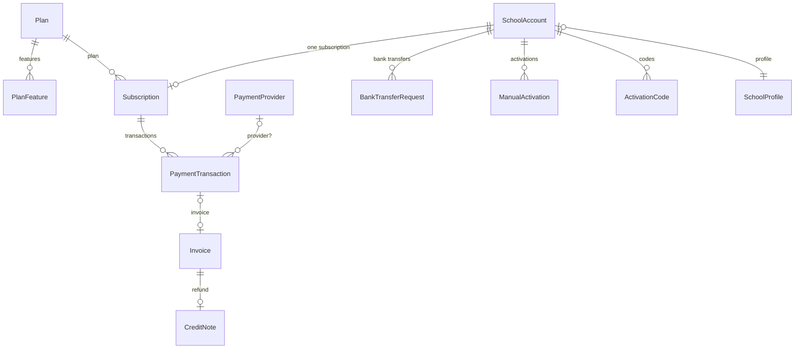
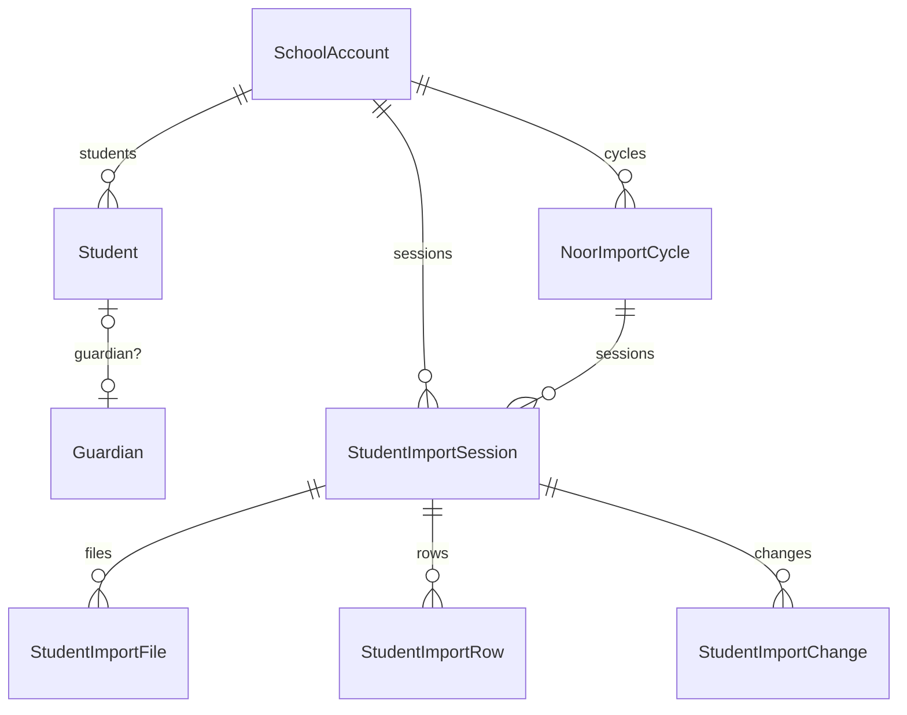
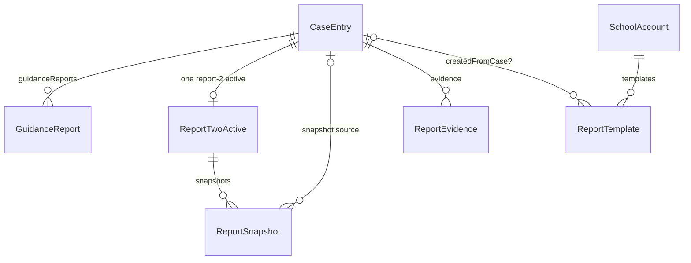
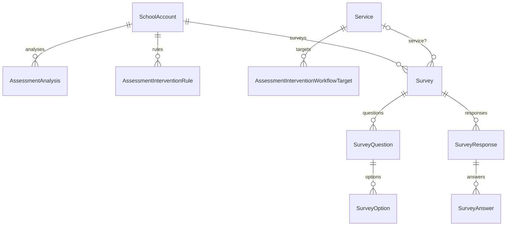
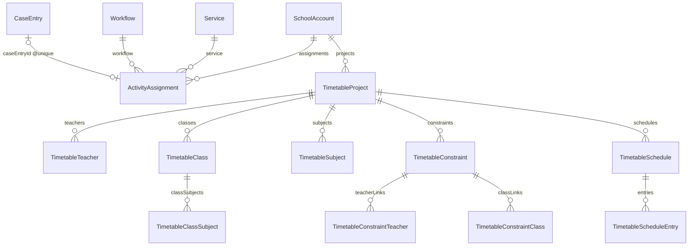

# ERD — مخطط العلاقات

مخطط العلاقات الكيانية حسب `prisma/schema.prisma`. يُعرض هنا بالنطاقات الأهم؛ القائمة الكاملة في `models-reference.md`.

## 1) النواة: الخدمات → سير العمل → الحالات

## 2) الاشتراكات والفوترة

## 3) الطلاب والاستيراد

## 4) التقارير

## 5) التقييمات والاستبيانات

## 6) النشاط والجدول

## ملاحظات إبرازية

- **`Subscription.schoolAccountId` فريد** — اشتراك واحد لكل مدرسة، upsert بدل create.
- **`ActivityAssignment.caseEntryId` فريد** — مهمة نشاط تعتمد حالةً واحدة فقط عند الموافقة.
- **`Workflow.activeKey` فريد (اختياري)** — يضمن سير عمل نشطًا واحدًا لكل فتحة خدمة.
- **`CaseValue.fieldId` قابل للـ null** — عمليًا لا يُعيّن؛ القيم تُربط بـ`fieldKey`.
- **`Survey.audienceType` نص حر** وليس enum.
- **`WebhookEvent.providerId` يقصد `IntegrationProvider`** وليس `PaymentProvider` (M13).
