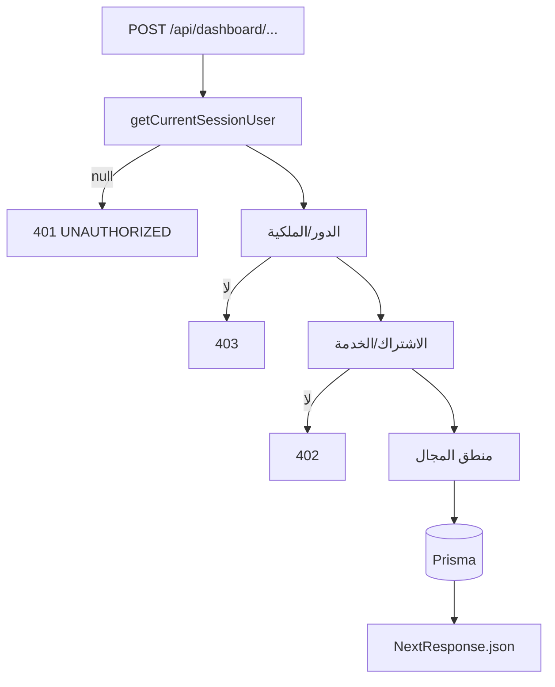

# إضافة مسار API جديد — Adding a New API

## المكان
- داخلي (لوحات): `app/api/dashboard/<module>/route.ts` (أو `/[...]/route.ts`).
- عام (بدون جلسة): `app/api/<module>/route.ts` (مثل `survey/[token]/submit`).

## النمط القياسي

```ts
// app/api/dashboard/<module>/route.ts
import { NextRequest, NextResponse } from "next/server";

export async function POST(req: NextRequest) {
  // 1) الجلسة
  const ctx = await getCurrentSessionUser();
  if (!ctx) return NextResponse.json({ error: "UNAUTHORIZED" }, { status: 401 });

  // 2) الحراسة العامة/الدور/الملكية
  // requireDashboardApiContext() أو requireRole(...) أو requireSameSchoolApi(...)

  // 3) الاشتراك/الخدمة عند الحاجة
  // requireActiveSubscriptionForCurrentUser / requireServiceAccessForCurrentUser

  // 4) منطق المجال عبر engine/lib (لا Prisma مباشرة في المسار)
  // 5) معالجة الأخطاء + سجل نشاط
}
```

## القواعد
1. **لا تكتب Prisma مباشرة في route** — استخدم دوال `engine/` أو `lib/` (مثل `saveRuntimeCase`).
2. **تحقق الملكية**: استخدم `requireSameSchoolApi` أو شروط `schoolAccountId` — كل البيانات معزولة بمدرسة.
3. **زود (zod)**: استخدم `zod` للتحقق من المدخلات (نمط `lib/auth/public-registration-schema.ts`).
4. **خطأ JSON**: 401 (جلسة)، 403 (دور/ملكية)، 402 (اشتراك/خدمة)، 404/409/422 حسب الحالة.
5. **سجل النشاط**: عند عمليات الكتابة استخدم `lib/admin/activity-log.ts` (فاحص `PlatformActivityLog`).
6. **الجلسة العامة**: مسارات بدون جلسة (token-based) مثال: `app/api/teacher/activity-assignment/[token]/submit`.

## إضافة في خريطة الوثائق
- حدّث `docs/api/api-map.md` و`docs/api/api-by-module.md`.

## مخطط حراسة


