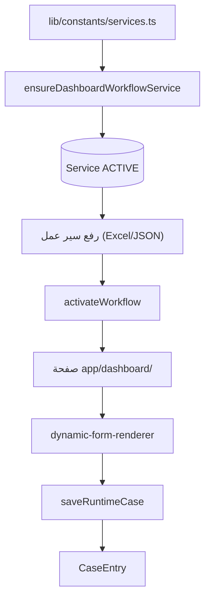

# إضافة خدمة جديدة — Adding a New Service

خطوات إضافة خدمة إرشادية جديدة في المنصة.

## 1) التعريف في الكتالوج
في `lib/constants/services.ts`:
- أضف `{ slug, title, description, href, kind: "workflow" }` إلى القائمة المناسبة:
  - إرشادية مرشد → `COUNSELOR_GUIDANCE_WORKFLOW_SERVICES`.
  - نشاط/أداء معلم → `workflowServices`.
  - مستقلة (بدون سير عمل) → `standaloneServices` (kind: "standalone").
- أضفها إلى `workflowUploadServices` إن كانت قابلة لرفع سير عمل، و`dashboardServices`.

## 2) ضمان وجود الخدمة في قاعدة البيانات
الخدمات تُنشأ عبر:
- `lib/admin/workflows/ensure-dashboard-workflow-services.ts` (`ensureDashboardWorkflowService`).
- `engine/services/service-workspace-engine.ts` (`ensureServiceBySlug`).
- أو بذرة مستقلة في `lib/services/default-platform-services.ts`.

> لا تُنشئ صف `Service` يدويًا عبر SQL مباشرة إن أمكن — استخدم المحرّك المضمّن.

## 3) إنشاء سير عمل
- واجهة: `app/dashboard/admin/workflows` (رفع Excel أو JSON draft ثم publish ثم activate).
- خادم: `POST /api/dashboard/admin/workflows/upload` أو `[serviceSlug]/draft`.
- سيكون النشط وحيدًا عبر `activeKey = serviceId:workflowType`.

## 4) صفحة الخدمة
- أضف مسار لوحة أسفل `app/dashboard/<slug>/` يعرض نموذج سير العمل:
  - `getRuntimeWorkflowByServiceSlug(slug)` لتحميل السير.
  - `components/workflow/dynamic-form-renderer.tsx` للعرض.
  - حفظ عبر `POST /api/dashboard/cases/save-draft` أو `submit`.

## 5) الوصول والاشتراك
- لضمان ظهور الخدمة في الخطط: أضف ميزة `service:<slug>` = "enabled" في الخطة المرغوبة (`PlanFeature`).
- أو أنشئ صف `ServiceAccess` للمدرسة عبر إدارة المسؤول (`toggle-service-access`).

## 6) التقارير (اختياري)
- قوالب تقارير للخدمة عبر `app/dashboard/admin/report-templates` (تحدد `serviceSlug`).

## قائمة تحقق
- [ ] الكتالوج (lib/constants/services.ts)
- [ ] الخدمة في DB (ensure/seed)
- [ ] سير عمل نشط
- [ ] صفحة لوحة + نموذج
- [ ] ميزة الخطة / وصول مدرسة
- [ ] (اختياري) قوالب تقارير + ربط report-2

## مخطط

