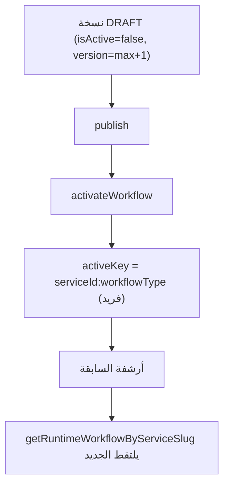

# إضافة سير عمل جديد — Adding a New Workflow

## الخيارات المتاحة
1. **رفع Excel** (الطريق الموصى به): `POST /api/dashboard/admin/workflows/upload`.
   - المحلل: `lib/workflow-upload/workflow-excel-parser.ts` (صفوف ترويسة، أسماء بديلة AR/EN، تطبيع عربي).
   - المحرك: `engine/workflow-upload/workflow-upload-engine.ts` (`uploadWorkflowForService`).
2. **بناء JSON**: `POST /api/dashboard/admin/workflows/[serviceSlug]/draft` (Steps/Fields/Options).
3. **قالب برمجي**: بعض الخدمات تبذر قالبًا (مثل `lib/workflows/guardian-summons-workflow-template.ts`).

## دورة النشر

## التحقق
`engine/workflow-validation/workflow-validator.ts` `validateWorkflow`:
- نقاط: 40 (رفع ناجح) / 75 (شبه مكتمل) / 100 (مكتمل).
- مفتاح مكرر، dependsOn مفقود، `linkedToValue` بلا هدف، أكثر من 12 حقلًا (تحذير).

## خطوات عمليّة
1. حدّد `serviceSlug` (خدمة موجودة؛ إن لم تكن، اتبع `adding-new-service.md`).
2. جهّز ملف Excel وفق صيغة المحلل (أو استخدم واجهة draft).
3. ارفع → عاين في `app/dashboard/admin/workflows`.
4. افحص التحقق (نقاط) → صحّح إن لزم.
5. publish → activate.
6. جرّب من صفحة الخدمة (نموذج + حفظ حالة).

## تنبيهات
- إضافة أنواع حقول جديدة تتطلب تعديل `FieldType` (schema) + العارض + قائمة الأنواع المسموحة — انظر `where-do-i-change-this.md`.
- المسار القديم `workflow-builder` لا يُستخدم للإنشاء الحديث (H7).
- لقطة سير العمل تُؤخذ عند حفظ الحالة — تغيير سير العمل لا يعدّل الحالات القائمة تلقائيًا.
