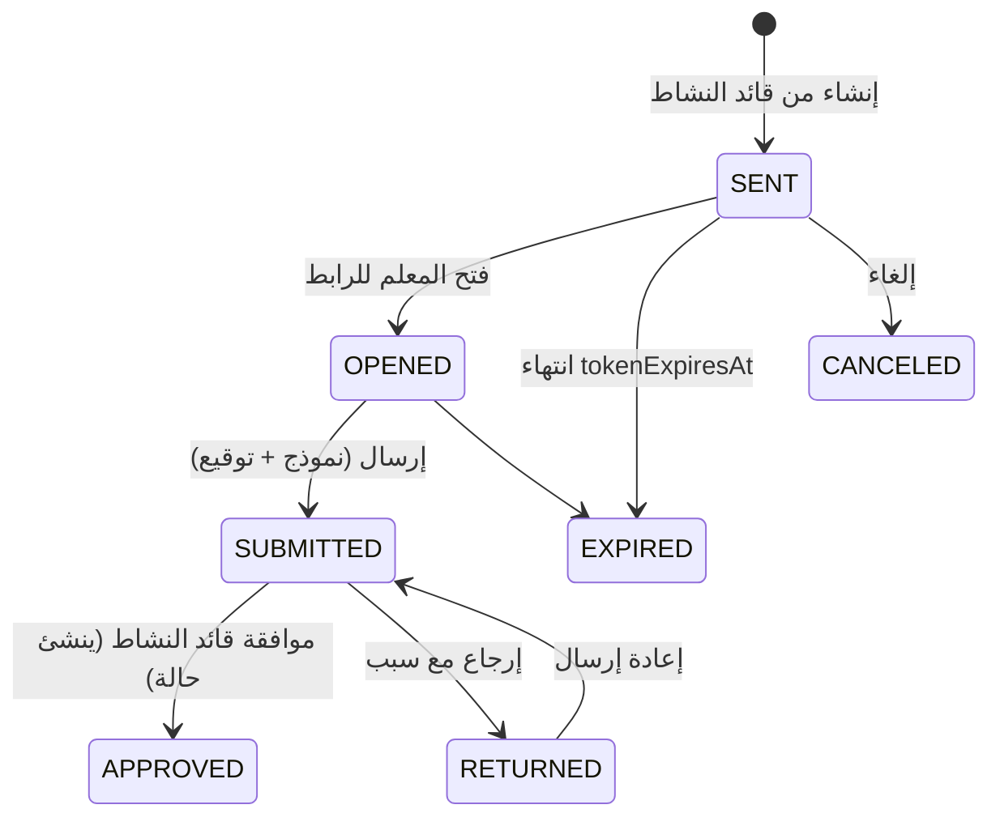
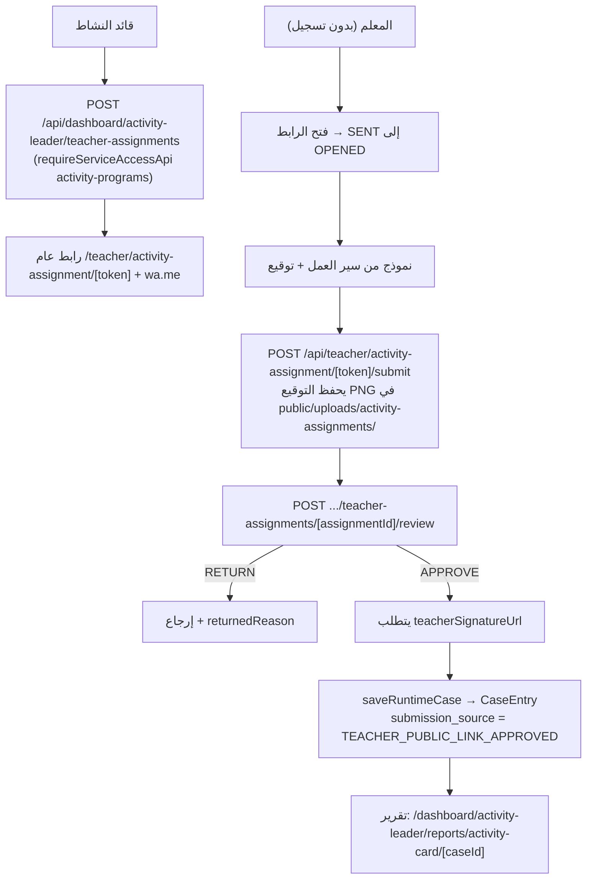

# تدفق مهام النشاط — Activity Assignment Flow

مهام من قائد النشاط إلى معلم عبر رابط عام بدون تسجيل دخول.

## النموذج

`ActivityAssignment`:
- `serviceId` + `workflowId` + `domainSlug`/`domainTitle`.
- `teacherName/Phone/Email`.
- `token` فريد + `tokenExpiresAt`.
- `status`: `SENT | OPENED | SUBMITTED | APPROVED | RETURNED | EXPIRED | CANCELED`.
- `submittedValues`/`submittedEvidenceItems` (JSON).
- `caseEntryId` فريد (يُعيّن عند الموافقة).

## الدورة

## التدفق

## تفاصيل

- الرسالة عبر `wa.me` تقول "لا تحتاج تسجيل دخول".
- الصفحة العامة تفحص حالات `EXPIRED/CANCELED/APPROVED/SUBMITTED` وتمنع الوصول المناسب.
- `domainSlug` يمثل نطاق النشاط (المواطنة، الثقافة، الرياضية، العلمية...).
- لا يوجد استخدام QR في هذا التدفق (QR موجود فقط في مكوّن مشاركة الاستبيان).
- تقارير النشاط تعرض القيم المرسلة عبر `activity-card-report-runtime.ts`.
