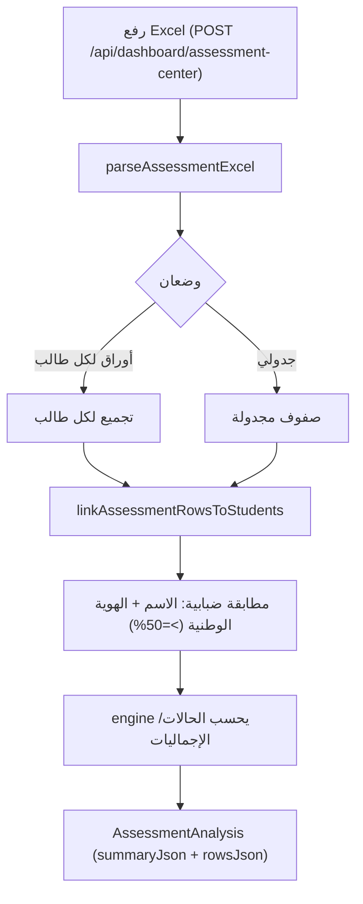
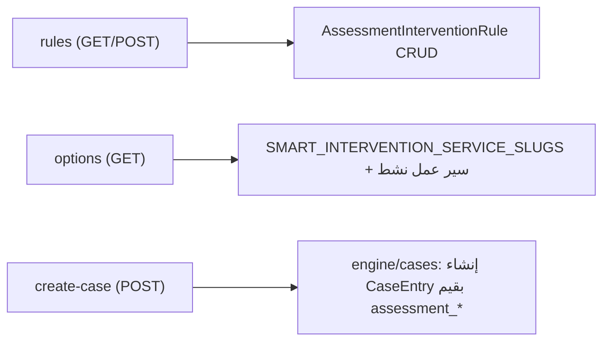

# تدفق مركز التقييمات — Assessment Center Flow

تحليل ملفات Excel للتقييمات، ربطها بالطلاب، ثم استخراج تدخلات.

## المكونات

- `lib/assessment-center/` — parser، ربط طلاب، ملخص، رؤى، أنواع تدخلات، تقرير PDF، أنواع.
- `engine/assessment-center/assessment-center-engine.ts` — المحرك.
- `app/api/dashboard/assessment-center/*` — المسارات.

## 1) الرفع والتحليل

## 2) ربط الطلاب يدويًا

- `[analysisId]/student-linking` PATCH — ربط/فك ربط يدوي.
- `student-linking/auto` — إعادة التشغيل التلقائي.

## 3) التدخلات الذكية

- `interventions/create-case` يتحقق أن `targetServiceSlug` يطابق `targetType`، ثم ينشئ حالة مع `workflowSnapshot` وحوالي 20 قيمة `assessment_*` (JSON + نص) — تدخل مباشرة إلى استوديو report-2.

## الملاحظات

- نوع الهدف يرتبط بالخدمات: `SMART_INTERVENTION_TARGET_SERVICE_SLUG_BY_TYPE` في `lib/constants/services.ts`.
- قواعد التدخل تُخزَّن لكن **لا تُنفَّذ** — `create-case` يأخذ الحزمة مباشرة (M2).
- `AssessmentInterventionWorkflowTarget` غير مستخدم (M2).
- ملخصان متباعدان الحدود: 90/70/50 مقابل 90/80/70/60 (M1).
- تحليل رقمي/عربي للحقول؛ تصدير PDF عبر `assessment-pdf-report`.
