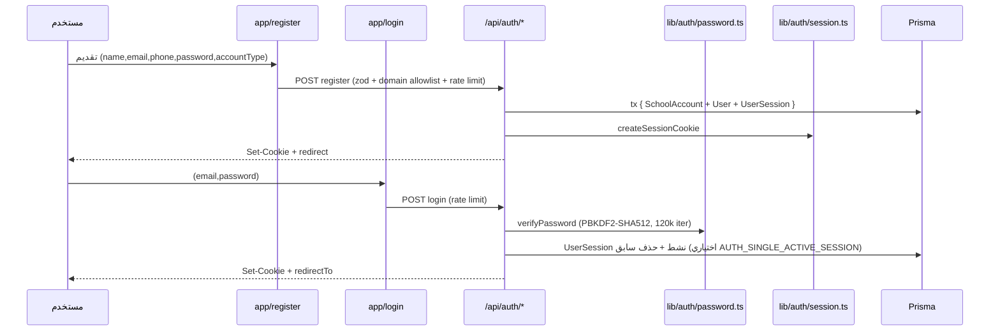

# تدفق المصادقة — Authentication Flow

## الخطوات

1. **التسجيل** — `app/register` → `POST /api/auth/register`:
   - معدّل الطلب: 5 محاولات / 30 دقيقة لكل IP+بريد.
   - `public-registration-schema.ts`: يسمح بـ`COUNSELOR/ACTIVITY_LEADER/TEACHER/PRINCIPAL`، يفرض قائمة نطاقات بريدية معروفة.
   - `public-registration-service.ts` `registerPublicAccount`: معاملة Serializable تُنشئ `SchoolAccount` + `User` + `UserSession`.
2. **الدخول** — `app/login` → `POST /api/auth/login`:
   - معدّل: 8 محاولات / 10 دقائق لكل IP+بريد.
   - تحقق كلمة المرور PBKDF2 (`lib/auth/password.ts`).
   - تعيين خطة مجانية افتراضية عند الحاجة.
   - إنشاء كعكة `student_guidance_session` + صف `UserSession`.
3. **الخروج** — `POST /api/auth/logout`: إبطال الجلسة (`revokedAt`) + مسح الكعكة.

## مخطط

## تنسيق الجلسة

- كعكة: `student_guidance_session` — httpOnly, sameSite=lax, secure في الإنتاج, maxAge 14 يومًا.
- الحمولة: `{ userId, email, role, schoolAccountId, sessionId, tokenId, exp }`، توقيع HMAC-SHA256 بمفتاح `AUTH_SECRET`/`NEXTAUTH_SECRET`.
- التحقق في كل طلب: `getCurrentSessionUser()` — HMAC + فحص `exp` + بحث في `UserSession` بالـ `tokenId` + تحديث `lastSeenAt`.

## حراس الصفحات والـ API

- `proxy.ts`: فحص سطحي للكعكة فقط (`contains(".") && length>40`) على `/dashboard/*` و`/api/dashboard/*`.
- داخل الصفحات: `requireDashboardUser()`.
- داخل الـ API: `requireDashboardApiContext()` من `dashboard-context.ts`.

## ملاحظات

- لا توجد مسارات `/verify` أو `/me` أو `/reset-password` أو `/forgot-password` في الـ API — صفحات الاستعادة واجهات ثابتة بلا باك-إند (L9).
- حدّ المعدل في الذاكرة فقط (per-instance) — يُفقد عند إعادة التشغيل.
- صفحة `app/teacher/login` ترسل `loginPath:"teacher"` لدعم فحص خاص في مسار login.
