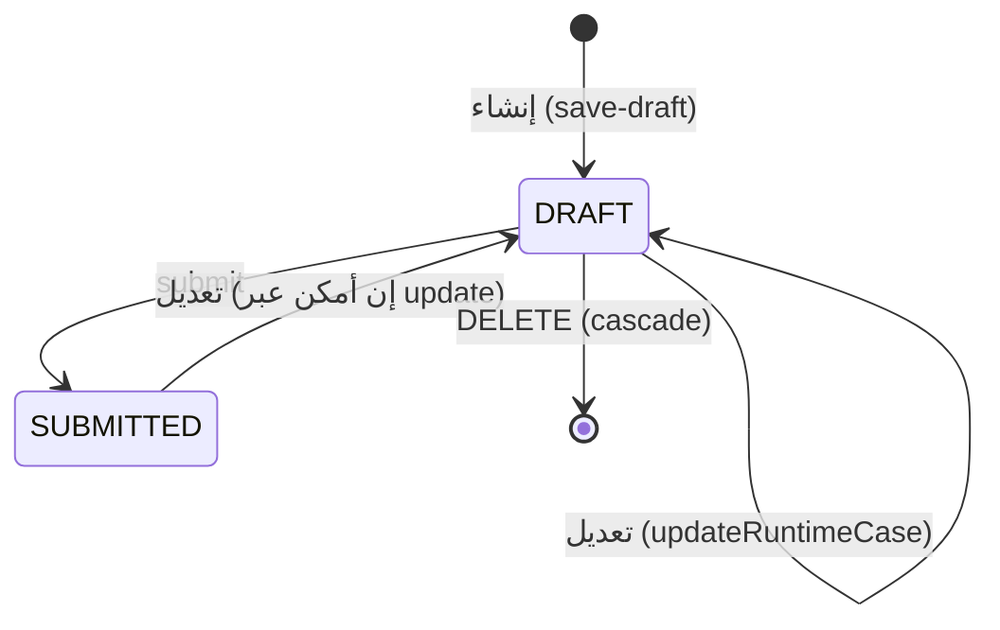
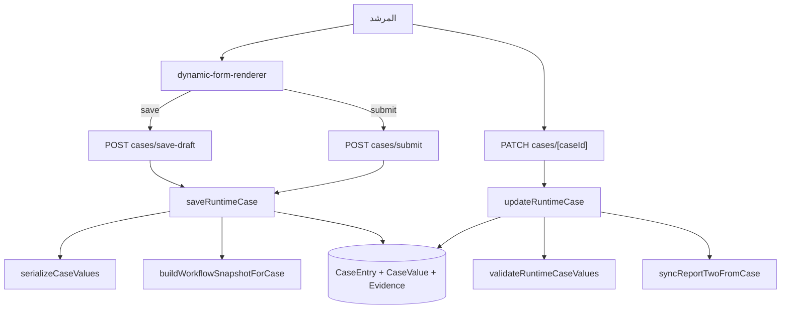

# دورة حياة الحالة — Case Lifecycle

الحالة `CaseEntry` هي "حفلة الإدخال" لكل خدمة. تنشأ من نموذج سير العمل وتخزن القيم والأدلة.

## الحالات

`CaseStatus`: `DRAFT | SUBMITTED | ARCHIVED`
> `ARCHIVED` معرّف وله تسمية واجهة لكن **لا يوجد مسار يكتبه** (M5).

## الدورة

## عمليات الحالة

### الإنشاء — `saveRuntimeCase` (POST `cases/save-draft` | `cases/submit`)
1. تحقق الخدمة/سير العمل/الطالب.
2. `mergeStudentSnapshotsIntoValues` — دمج `studentSnapshot`/`guardianSnapshot`/`selectedStudent`.
3. `serializeCaseValues` (`lib/cases/case-values.ts`): القيم البدائية → `value` نصي، المصفوفات/الكائنات → `jsonValue`.
4. `buildWorkflowSnapshotForCase` — لقطة سير العمل → `CaseEntry.workflowSnapshot`.
5. إنشاء `CaseEntry` + `CaseValue[]` + `Evidence[]`.
6. عند `SUBMITTED` تُضبط `submittedAt`.

### التحديث — `updateRuntimeCase` (PATCH `cases/[caseId]`)
1. معاملة: حذف كل `CaseValue`+`Evidence` ثم إعادة إنشائها (استبدال كامل — H3).
2. `validateRuntimeCaseValues`: التحقق من القيم مقابل اللقطة أو سير العمل الحي.
3. مفاتيح النظام `RUNTIME_SYSTEM_VALUE_KEYS` تُتجاوز.
4. اختيارات الخيارات يجب أن تكون ضمن `allowed set`؛ `__other` مقبول إذا `allowOther`.
5. `syncReportTwoFromCase` + `logCaseSavedEvent`.

### القراءة — `getCaseById`
يشمل `values` (مع الحقول/الخيارات) و`evidences` و`guidanceReports`.

### الحذف — DELETE `cases/[caseId]`
يُحذف معه: التقارير، اللقطات، `CaseEvidence`، التذكيرات، وحذف الملفات الفعلية.

## مخطط تدفق

## قائمة المسارات

| المسار | الطريقة | الوظيفة |
|---|---|---|
| `app/api/dashboard/cases/save-draft` | POST | حفظ مسودة (حالة DRAFT) |
| `app/api/dashboard/cases/submit` | POST | حفظ + تقديم (SUBMITTED) |
| `app/api/dashboard/cases/[caseId]` | GET/PATCH/DELETE | قراءة/تعديل/حذف |
| `app/api/dashboard/cases/autosave` | POST | **وهمي** (auth فقط — M6) |
| `app/api/dashboard/evidence` | POST | رفع `CaseEvidence` (نظام موازٍ) |

## عرض القيم

- `restoreCaseDraft` يعيد `value.jsonValue ?? value.value` لكل `fieldKey`.
- العرض في `lib/cases/workflow-display-value.ts` يعتمد `fieldKey` لأن `CaseValue.fieldId` نادرًا ما يُعيّن.

## عناوين الحالات

- عميل: `getSmartRuntimeCaseTitle` — رموز `program/activity/title/برنامج/نشاط/عنوان/موضوع`.
- خادم: `resolveArabicCaseReportTitle` في `lib/cases/resolve-arabic-case-report-title.ts` — العنوان المحفوظ → محلول الخيارات → اللقطة/سير العمل/اسم الخدمة → "تقرير الحالة".

## أدلة

- `Evidence` (من حفظ الحالة؛ `EvidenceType` = IMAGE/FILE/LINK).
- `CaseEvidence` (من `/evidence`؛ نوع مشتق من `mimeType` فقط) — H2.

## ملاحظات

- قائمة الحالات تُقدَّم كـ Server Component في `app/dashboard/cases/page.tsx` (لا يوجد API للقائمة).
- لا يوجد تدفق "اعتماد حالة" — الاعتماد يقع على التقارير (`ReportSnapshot`).
