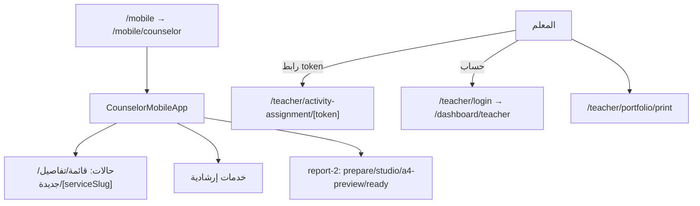

# تدفق الجوال — Mobile Flow

## المرشد (Counselor Mobile SPA)

- `app/mobile/` يوجّه إلى `/mobile/counselor`.
- `app/mobile/counselor/` — تطبيق صفحة واحدة للمرشد:
  - `components/mobile/counselor-mobile-app.tsx` + shell + أيقونات.
  - أقسام: الحالات (قائمة/تفاصيل/جديدة/`[serviceSlug]`)، خدمات إرشادية (`guidance-programs`, `student-guidance-services`, `family-school-communication`, `student-follow-up`, `committees-meetings/new`).
  - تدفق report-2 داخل الجوال: `prepare` → `studio` → `a4-preview` → `ready`.
- `app/mobile-preview/counselor/` — نسخة معاينة مزدوجة.

## المعلم (Teacher)

- لا يوجد تطبيق جوال منفصل للمعلم — بوابة المعلم عبر الرابط العام:
  - `app/teacher/activity-assignment/[token]/` — تنفيذ المهمة.
  - `app/teacher/login` — دخول المعلم إلى اللوحة.
  - `app/teacher/portfolio/print` — طباعة المحفظة.

## مخطط

## ملاحظات

- لا يوجد `lib/mobile/`.
- الجوال يعتمد على نفس واجهات `app/api/dashboard/*` وحماية الجلسة العادية.
- رموز QR موجودة في مشاركة الاستبيان (`components/surveys/survey-share-shell.tsx`) وليس في مهام النشاط.
