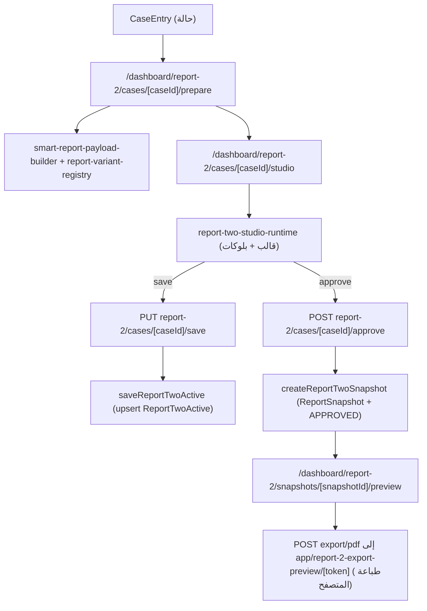

# تدفق التقارير — Reports Flow

المنصة فيها عدة أجيال من التقارير. المسار الحي والرئيسي هو **report-2**.

## الأجيال باختصار

| الجيل | المسارات | الحالة |
|---|---|---|
| report-2 (نشط) | `lib/report-2` + `components/report-2` + `app/dashboard/report-2` | الرئيسي |
| report-engine (العارض الحديث) | `lib/report-engine` + `components/report-engine` | يُستهلك من report-2 |
| report-1 / GuidanceReport | `app/api/dashboard/report-1` + `components/report-1` | قديم، ما زال يكتب `GuidanceReport` |
| reports (قديم) | `app/api/dashboard/reports` + `components/reports` | شبه مهجور (الصفحات الرئيسية تحوّل إلى report-2) |
| report-engine-legacy / reports-legacy | `lib/report-engine-legacy` + `lib/reports-legacy` | كود ميت (H6) |
| قوالب التقارير | `ReportTemplate` + `app/api/dashboard/report-templates` | منصّة القوالب |
| تقارير مخصصة | `lib/custom-report` | schema مولّد بالذكاء الاصطناعي |
| تقارير إحصائية | `lib/statistics` + `StatisticalReport` | تحليلات كمية |

## تدفق report-2

## نقاط مفصلة

### 1) Prepare
- `lib/report-engine/smart-report-payload-builder.ts` — بناء الحمولة من قيم الحالة.
- `report-variant-registry.ts` — اختيار النوع (رسمي/نشاط/تنفيذي...).
- `components/report-flow/report-prepare-flow.tsx` — واجهة التحضير مع `lib/report-flow/report-flow-payload.ts` (فلترة/ترجمة) و`report-flow-storage.ts`.

### 2) Studio
- `components/report-2/report-two-studio-runtime.tsx` (≈6,557 سطرًا): اختيار قالب (فلترة `ReportTemplate` حسب `serviceSlug`)، تحرير بلوكات/صفحات، معرض أدلة، توقيعات.

### 3) Save
- `saveReportTwoActive` — upsert على `caseEntryId` الفريد.
- 409 عند تحرير تقرير APPROVED دون `approvedEditConfirmed`.
- `version` تفاؤلي لمنع تعارضات الكتابة.
- يخزّن: `sourcePayload`, `editorState`, `templateJson`, `pagesJson`, `renderedHtml`, `renderContext`, `previewCase`.

### 4) Approve / Snapshot
- `createReportTwoSnapshot` — صف `ReportSnapshot` جديد + قلب `ReportTwoActive.status` إلى `APPROVED`.
- اللقطة تحفظ `approvedById/approvedByName/approvedAt`.

### 5) Preview / PDF
- معاينة: مسار هيكلي (`ReportDesignRenderer` + `ReportTwoSnapshotPrintController`) أو `snapshotHtml` قديم عبر `dangerouslySetInnerHTML`.
- تصدير: يكتب JSON معقّم إلى `.tmp/report-2-export/{token}.json` ويعيد `PRINT_PREVIEW` إلى صفحة طباعة المتصفح (لا PDF خادمي).

### 6) الأدلة والتوقيعات
- `collectEvidence` في `report-two-structured-data.ts` — من مفاتيح الحمولة.
- `lib/report-engine/report-evidence-utils.ts` — فلترة.
- بلوكات `evidence-gallery`/`signature-grid`؛ النمط الرسمي `report-two-official-activity-signature-style.tsx`.
- المرفقات المرتبطة (شهادات/تقييمات/استبيانات) تُلحق من الخادم بـ`__linkedAttachmentsHtml`.

## الترقيم الذكي (Smart Physical Page Composer)

- المالك الرسمي: `lib/report-engine/physical-layout/physical-layout-planner.ts`.
- تنفيذ عميل: `components/report-engine/design-renderers/smart-layout/` (`report-smart-page-composer.tsx`, `report-smart-physical-pages.tsx`, `report-smart-a4-planner.ts`, `report-smart-block-pagination.ts`).
- قديم تقديري: `lib/report-engine/report-block-paginator.ts` (سعة 260 حرفًا) — L7.

## قوالب التقارير (`ReportTemplate`)

- `type`: `SYSTEM | SCHOOL | PERSONAL`.
- `templateJson`: `pages[]` ثم `blocks[]` (النموذج في `lib/report-engine/report-template-builder-types.ts`).
- دقة: `GLOBAL|SERVICE|WORKFLOW|SUB_WORKFLOW`؛ حالة: `DRAFT|PUBLISHED|ARCHIVED`.
- مسارات: `app/api/dashboard/report-templates/{route, [templateId]/route, [templateId]/use}`.
- واجهة: `app/dashboard/admin/report-templates` (استوديو، مكتبة، تصميمات، معاينة).

## تصدير PDF بأنظمة أخرى

| النظام | الأداة | المسار |
|---|---|---|
| تقارير GuidanceReport | Playwright chromium | `reports/[reportId]/export/pdf` و`report-1/[reportId]/export/pdf` |
| إنفويسات | Puppeteer | `admin/payments/invoices/[invoiceId]/pdf` |
| شهادات | Puppeteer | `certificates/[certificateId]/export/pdf` |
| استبيانات/مدفوعات/شهادات (bulk) | exceljs | تصدير Excel |
| تصدير تحليلات | xlsx / CSV | `results-analysis/[analysisId]/export` |

## تناقضات معروفة

- مساران للعرض (structured vs snapshotHtml) (M9/M8).
- كود اعتماد مكرر غير قابل للوصول في `report-two-studio-runtime.tsx` (M9).
- نظامان للترقيم (L7).
