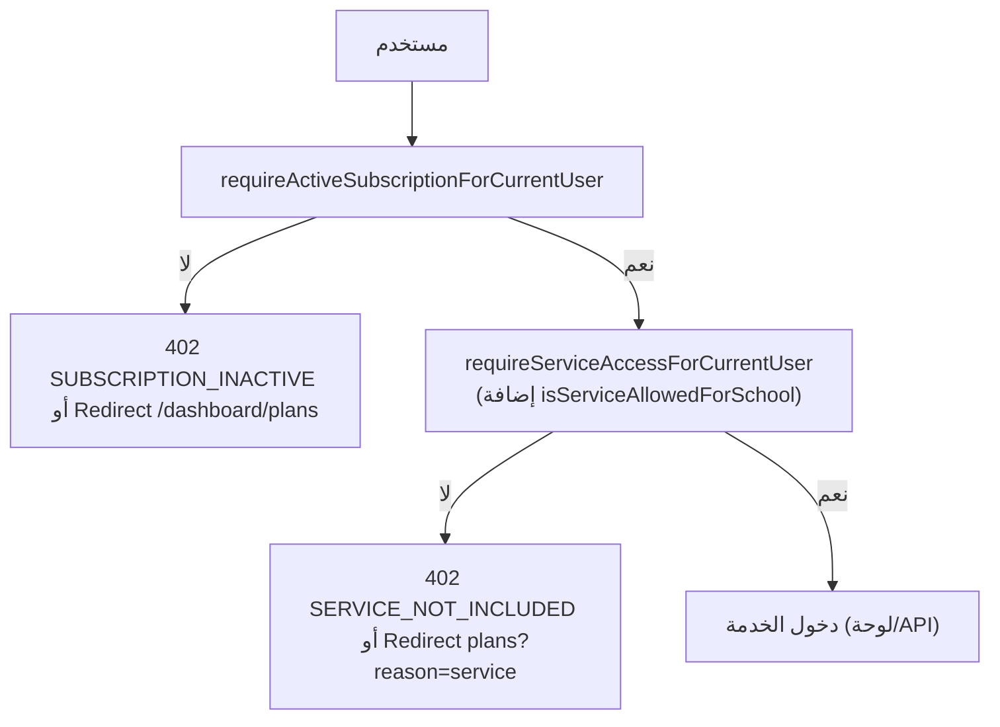

# وصول الخدمات — Service Access Flow

كيف تصل المدرسة (حسابها) إلى خدمة إرشادية معينة.

## المفهوم

كل خدمة `Service` لها وصول لكل مدرسة عبر جدول `ServiceAccess` (فريد على `schoolAccountId + serviceId`). الخطة تحدد الخدمات المشمولة عبر ميزة `service:<slug>`.

## فحص الوصول — `isServiceAllowedForSchool`

الترتيب (من `lib/subscription/subscription-service.ts`):

1. لا اشتراك قابل للاستخدام → مرفوض.
2. الخطة تشمل `service:<slug>` → إن لم يوجد صف وصول: إنشاء كسول، ثم السماح.
3. الخطة تملك أي قواعد خدمات لكن لا تشمل هذه → رفض `SERVICE_NOT_INCLUDED`.
4. لا صفوف `ServiceAccess` إطلاقًا → سماح مفتوح `NO_SERVICE_RULES_YET` (انتبه M12).
5. وإلا → اعتماد `ServiceAccess.isEnabled`.

## مسار الطلب

## تطبيق الخطة على الوصول

`syncSchoolServicesFromPlan(plan, schoolAccountId)`:
- يمسح كل صفوف `ServiceAccess` للمدرسة ثم يعيد بناء المشمول منها — لذا لا تُضف صفوفًا يدويًا.

## مسارات متعلقة

- `GET /api/dashboard/subscription` — نظرة على الاشتراك + توزيع الخطة المجانية الافتراضية.
- إدارة المسؤول: `POST /api/dashboard/admin/subscriptions/toggle-service-access` — تفعيل/تعطيل خدمة لمدرسة.

## ضمان وجود الخدمة في قاعدة البيانات

- `ensureDashboardWorkflowServices()` في `lib/admin/workflows/ensure-dashboard-workflow-services.ts` — يضمن وجود `Service` لخدمات الرفع.
- `engine/services/service-workspace-engine.ts` — `ensureServiceBySlug` عند كل زيارة مساحة عمل.
- `lib/services/default-platform-services.ts` — بذر الخدمات المستقلة.

## ملاحظات

- `ADMIN` يتجاوز فحص الاشتراك/الخدمة.
- مسارات الصفحات توجّه إلى `/dashboard/plans?reason=...`؛ مسارات الـ API تعيد 402 JSON.
- قائمة الخدمات المعروضة تسويقيًا في `app/services` تُقرأ من `lib/constants/services.ts` (`dashboardServices`).
