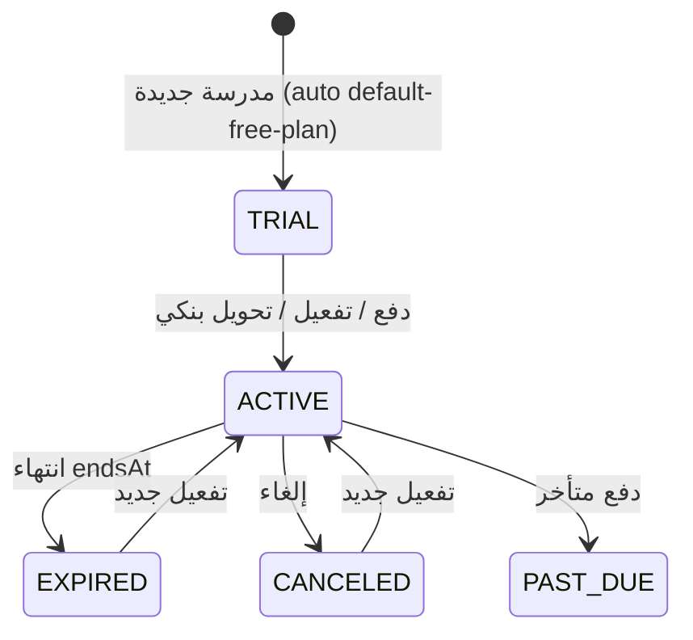
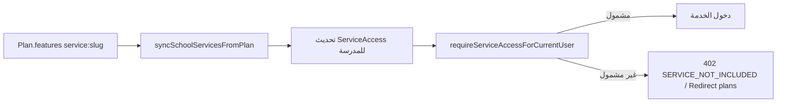

# تدفق الاشتراكات — Subscriptions Flow

## النموذج

- `Subscription` واحد لكل مدرسة (`schoolAccountId` فريد)، مرجع لخطة `Plan`.
- `PlanFeature` بمفتاح `service:<slug>` = `"enabled"` يحدد خدمات الخطة.
- `ServiceAccess` — وصول خدمة لكل مدرسة (`@@unique([schoolAccountId, serviceId])`).

## الحالات

`SubscriptionStatus`: `TRIAL | ACTIVE | PAST_DUE | CANCELED | EXPIRED`

## الدورة

## الخطة المجانية الافتراضية

- `lib/subscription/default-free-plan.ts` — الباقة `default-free-auto` ("الباقة التلقائية")، 14 يومًا، جميع الخدمات، سعر 0، غير عامة.
- تُعيَّن كسولًا عبر `assignDefaultFreePlanIfEligible` عند `GET /api/dashboard/subscription`.

## تطبيق الخطة على الخدمات

`syncSchoolServicesFromPlan` في `lib/subscription/subscription-service.ts`:
1. تعطيل كل `ServiceAccess` للمدرسة.
2. upsert صفوف الخدمات المشمولة في الخطة (enabled، مع `isPaid`).

## مسارات الدفع

| المسار | الوظيفة |
|---|---|
| `POST /api/payments/checkout` | إنشاء `PaymentTransaction` PENDING (CARD) + إرجاع checkoutUrl |
| `GET /api/payments/moyasar/callback` | إعادة جلب الدفعة واعتمادها (`applyPaidElectronicPaymentTransaction`) |
| `POST /api/payments/webhooks/[provider]` | ويب هوك Moyasar (secret + إعادة تحقق + idempotent عبر `WebhookEvent`) |
| `POST /api/payments/moyasar/apple-pay/session` | جلسة Apple Pay (اسم "Teachix/teachix.sa" — M14) |
| `POST /api/dashboard/subscription/bank-transfer` | إنشاء طلب تحويل بنكي PENDING |
| `POST /api/dashboard/subscription/redeem-code` | استبدال كود تفعيل |

## التفعيلات

- **يدوي** (`lib/activation/activation-service.ts`): `activateSchoolAccount`/`assignPlanToSchool` — يكتب `ManualActivation` كتدقيق.
- **أكواد**: `ActivationCode` بصيغة `RSHD-YYYY-xxxxxx`، استبدالها يرفع `usedCount` ويأخذ `durationDays`.
- **تحويل بنكي**: موافقة مسؤول → إنشاء معاملة PAID + اشتراك ACTIVE.

## الإنفويسات

- `InvoiceSettings` (إعدادات بائع مفردة؛ انتبه للافتراضيات التالفة L1).
- `InvoiceNumberSequence` (سنة/شهر) — ترقيم `invoiceNumber`.
- `CreditNote` بصيغة `CN-<رقم الإنفويسة>` عند الاسترداد.
- إصدار PDF للإنفويسات عبر Puppeteer.

## ملاحظات التناقضات

- `isSubscriptionUsable` مكررة في ملفّين (H2-similar).
- `NO_SERVICE_RULES_YET` يسمح بالوصول المفتوح عند غياب صفوف وصول (M12).
- `UsageLimit`/`UsageRecord` غير مستخدمة (M3).
