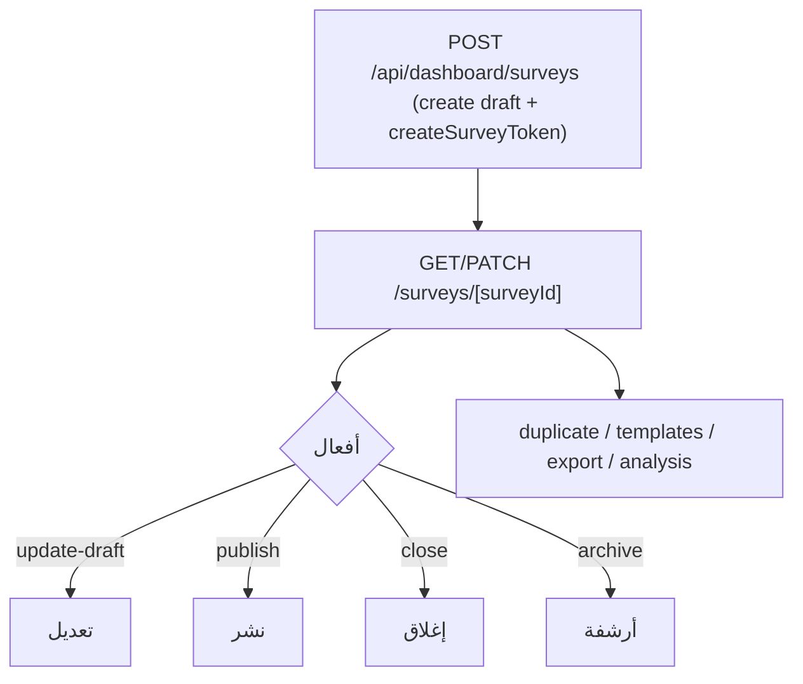
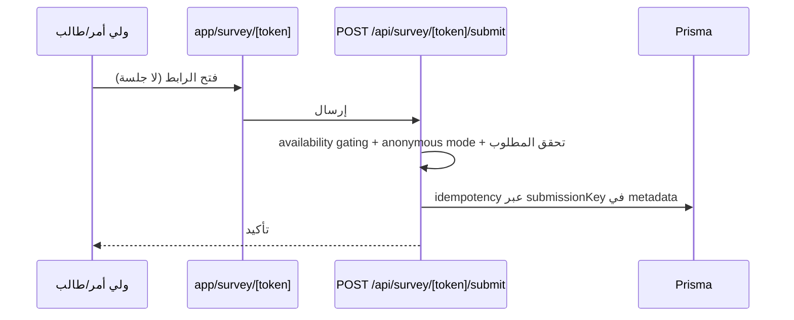

# تدفق الاستبيانات — Surveys Flow

استبيانات داخلية (لوحة) وعامة (روابط).

## النموذج

- `Survey` (سؤال) + `SurveyQuestion` + `SurveyOption` + `SurveyResponse` + `SurveyAnswer`.
- `Survey.token` فريد — رابط عام `app/survey/[token]`.
- `audienceType` نص حر وليس enum.
- عناوين الأقسام تُهرَّب في `helpText` عبر `[[survey-section]]` (L4).

## الإنشاء والنشر

- `templates` — إنشاء من قوالب `lib/surveys/survey-templates.ts`.
- `analysis` — إحصائيات لكل سؤال + `buildSurveyRecommendations` (قواعد استدلال).

## الرد العام

## الربط والاستهلاك

- `serviceId` اختياري — لا ربط مباشر بحالات أو طلاب.
- تُستخدم كهدف `DashboardResourceLink` بنوع `SURVEY_ANALYSIS`.
- تصدير النتائج: `export` (exceljs) و`export/pdf` (طباعة/Playwright).
