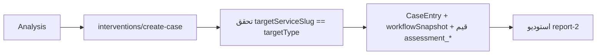

# وحدة مركز التقييمات — Assessment Center Module

## الغرض
رفع ملفات تقييمات Excel، تحليلها، ربطها بالطلاب، واقتراح تدخلات ذكية.

## الملفات
- `lib/assessment-center/` — parser، ربط، ملخص، رؤى، أنواع تدخلات، تقرير PDF، أنواع.
- `engine/assessment-center/assessment-center-engine.ts` — المحرك.
- `app/api/dashboard/assessment-center/*` — المسارات.

## المسارات

| المسار | الطريقة | الوظيفة |
|---|---|---|
| `app/api/dashboard/assessment-center` | POST | رفع + تحليل + حفظ `AssessmentAnalysis` |
| `.../[analysisId]/student-linking` | PATCH | ربط/فك طالب يدويًا |
| `.../student-linking/auto` | POST | إعادة الربط التلقائي |
| `.../[analysisId]/export` | GET | تصدير (xlsx/PDF) |
| `.../[analysisId]/delete` | DELETE | حذف |
| `.../interventions/rules` | GET/POST | إدارة `AssessmentInterventionRule` |
| `.../interventions/options` | GET | الخدمات المؤهلة + سير العمل النشط |
| `.../interventions/create-case` | POST | إنشاء حالة تدخل |

## التدخل

## ربط الطلاب
- مطابقة ضبابية: الاسم + الهوية الوطنية، ≥50% → ربط تلقائي بـ`Student`.

## نقاط للتنبه
- قواعد التدخل مخزونة ولا تُنفَّذ (M2).
- ملخصان بحدود مختلفة (M1).
- `AssessmentInterventionWorkflowTarget` غير مستخدم (M2).
- التفاصيل في `flows/assessment-center.md`.
