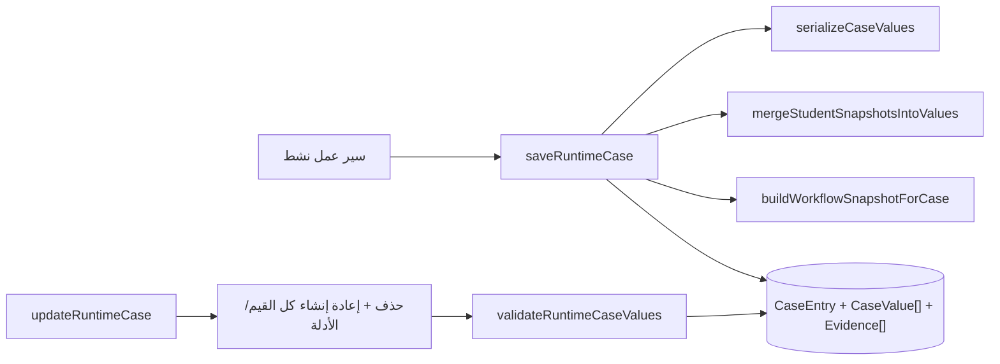

# وحدة الحالات — Cases Module

## الغرض
إنشاء/تعديل/قراءة/حذف `CaseEntry` بقيم `CaseValue` وأدلة `Evidence`، مع لقطة سير العمل.

## الملفات الرئيسية

| الملف | الدور |
|---|---|
| `engine/cases/case-runtime-engine.ts` | `saveRuntimeCase`, `updateRuntimeCase`, `getCaseById`, `restoreCaseDraft`, `buildWorkflowSnapshotForCase` |
| `lib/cases/case-values.ts` | `serializeCaseValues` (بدائي → value، مصفوفة/كائن → jsonValue) |
| `lib/cases/resolve-arabic-case-report-title.ts` | `resolveArabicCaseReportTitle` |
| `lib/cases/workflow-display-value.ts` | عرض قيمة حسب `fieldKey` |

## المسارات

| المسار | الطريقة | الوظيفة |
|---|---|---|
| `app/api/dashboard/cases/save-draft` | POST | حفظ مسودة |
| `app/api/dashboard/cases/submit` | POST | حفظ + تقديم |
| `app/api/dashboard/cases/[caseId]` | GET/PATCH/DELETE | قراءة/تعديل/حذف |
| `app/api/dashboard/cases/autosave` | POST | وهمي (M6) |
| `app/api/dashboard/evidence` | POST | رفع `CaseEvidence` |

## دورة الحياة
`DRAFT → SUBMITTED` (و`ARCHIVED` في الـ enum بلا كاتب — M5). تفاصيل في `flows/case-lifecycle.md`.

## مخطط الكتابة

## نقاط للتنبه
- `CaseValue.fieldId` لا يُعيّن — العرض بـ`fieldKey` (H4).
- التحديث حذفٌ كامل (H3).
- مسارا الأدلة المتوازيان `Evidence`/`CaseEvidence` (H2).
