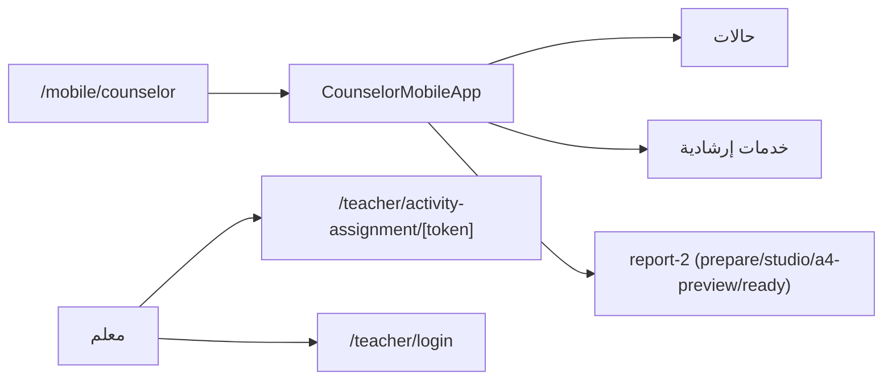

# وحدة الجوال — Mobile Module

## الغرض
تجربة جوال للمرشد (SPA داخل Next.js) + نقاط وصول المعلم.

## الملفات
- `app/mobile/` → يوجّه إلى `/mobile/counselor`.
- `app/mobile/counselor/` — `components/mobile/counselor-mobile-app.tsx` (shell + أقسام).
- `app/mobile-preview/counselor/` — نسخة معاينة.
- لا يوجد `lib/mobile/`.

## أقسام تطبيق المرشد
- الحالات: قائمة/تفاصيل/جديدة/`[serviceSlug]`.
- خدمات: `guidance-programs`, `student-guidance-services`, `family-school-communication`, `student-follow-up`, `committees-meetings/new`.
- تقارير report-2: `prepare` → `studio` → `a4-preview` → `ready`.

## المعلم
- `app/teacher/activity-assignment/[token]/` — تنفيذ المهمة (بدون تسجيل).
- `app/teacher/login` — دخول المعلم.
- `app/teacher/portfolio/print` — طباعة المحفظة.

## مخطط

## ملاحظات
- نفس الجلسة ومسارات `app/api/dashboard/*`.
- QR فقط في مشاركة الاستبيان (`components/surveys/survey-share-shell.tsx`).
