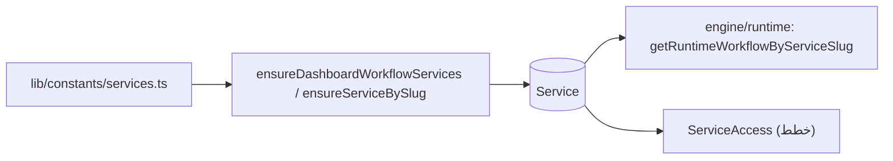

# وحدة الخدمات — Services Module

## الغرض
كتالوج الخدمات الإرشادية وربطه بقاعدة البيانات (`Service`).

## الكتالوج — `lib/constants/services.ts`

| التجميع | المحتوى |
|---|---|
| `COUNSELOR_GUIDANCE_WORKFLOW_SERVICES` | 7 خدمات مرشد: guidance-programs, student-follow-up, guardian-summons, committees-meetings, family-school-communication, student-guidance-services, student-guidance-evaluation-indicators |
| `workflowServices` | النشاط + أداء المعلم + إصدار تقرير المعلم + قائمة المرشد |
| `smartInterventionWorkflowServices` | 7 تدخلات ذكية من مركز التقييمات |
| `SMART_INTERVENTION_TARGET_SERVICE_SLUG_BY_TYPE` | ربط أنواع التقييم بالخدمات |
| `workflowUploadServices` | workflowServices + التدخلات |
| `standaloneServices` | مكتبة، نشاط أولياء، استبيانات، نتائج، تقييمات، تقارير، تقارير مخصصة |
| `dashboardServices` | workflow + standalone |

- نوع `AppService`: `{ slug, title, description, href, kind: "workflow"|"standalone"|"admin" }`.

## المزامنة مع قاعدة البيانات

- `lib/admin/workflows/ensure-dashboard-workflow-services.ts` — `ensureDashboardWorkflowService(slug)` يحدّث/ينشئ صف `Service` (ACTIVE) لخدمات الرفع.
- `lib/services/default-platform-services.ts` — بذر الخدمات المستقلة.
- `engine/services/service-workspace-engine.ts` — `ensureServiceBySlug` عند كل زيارة مساحة عمل.

## عرض الخدمات

- `app/services/page.tsx` (صفحة تسويقية) تعرض `dashboardServices`.
- لوحات الخدمات الفعلية في `app/dashboard/<slug>` (guidance-programs، student-follow-up، ...).
- لا يوجد `app/dashboard/services/*` ولا `app/api/dashboard/services/*` إلا `app/api/dashboard/statistics/services`.

## مخطط

## نقطة للتنبه
- الحراسة: خدمة خارجة عن الخطة تمنع حتى لو وُجد سير عمل — انظر `flows/service-access.md`.
