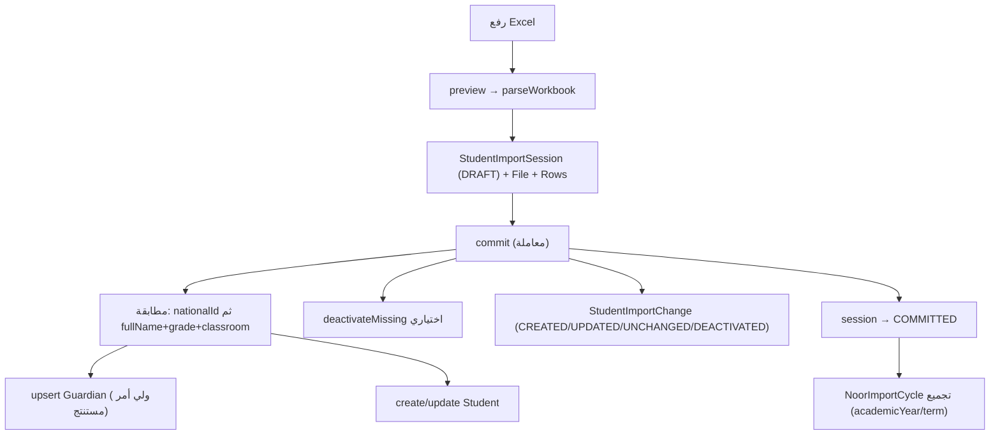

# وحدة الطلاب والاستيراد — Students Module

## الغرض
إدارة سجل الطلاب، استيراد من Excel (بصيغ Noor)، وخدمة البحث في منتقي الطلاب.

## النموذج
- `Student` (تابع لمدرسة، `guardianId` اختياري، `nationalId`، `fullName`، `gender`، `gradeLevel`/`classroom`/`section`).
- `Guardian` مستقل عن `User` (يُستنتج أحيانًا من أسماء الطلاب أثناء الاستيراد).
- لا يوجد ربط `User ↔ Student`؛ المعلم `User` بدور `TEACHER`.

## الاستيراد

### المسارات — `app/api/dashboard/data-center/*`
- `noor-import/` — `sessions`, `preview`, `cycles` (+`[cycleId]`), `[sessionId]/rows|commit|archive`.
- `student-data-import/` — **نسخة مطابقة موازية** (M-dupe)؛ أصل قديم في `school-data/student-import-sessions/`.
- `students/` — CRUD + `search` (بحث SQL خام بترتيب عربي).

### التدفق

### التنسيقات
- `lib/noor/excel-parser.ts` — parser عام لورقة واحدة بأسماء عربية بديلة.
- `lib/noor-import/noor-student-data-list-parser.ts` — صيغة قائمة بيانات Noor (عدة أوراق لكل صف، ولي أمر من الاسم المركب).
- `lib/noor-import/noor-import-cycle-sync.ts` — إعادة حساب حالة الدورة.

## منتقي الطلاب
- `app/api/dashboard/students/search` — بحث خام يُستخدم في `SmartStudentPickerCard`.

## نقاط للتنبه
- تعارض أسماء مسارات موازية (`noor-import` مقابل `student-data-import`).
- `noor-import-audit.ts` يكتب حقولًا لا تطابق `PlatformActivityLog` (L2).
- تفاصيل الحالات/المطابقة في `database/erd.md`.
