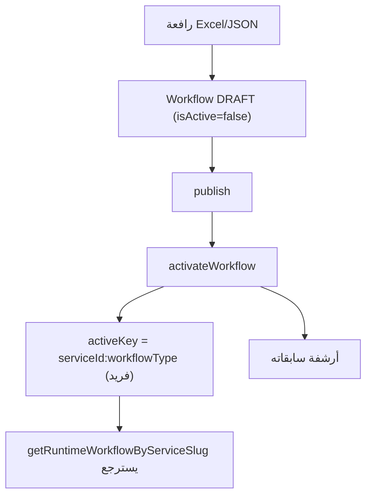

# وحدة محرك سير العمل — Workflow Engine Module

## الغرض
تحميل سير العمل النشط، التعامل الشرطي، التحقق، والإنشاء عبر Excel/JSON.

## الملفات الرئيسية

| الملف | الدور |
|---|---|
| `engine/runtime/runtime-resolver.ts` | `getRuntimeWorkflowByServiceSlug` |
| `lib/workflows/active-workflow-resolver.ts` | `buildActiveWorkflowSlotQuery` |
| `engine/runtime/workflow-conditional-logic.ts` | `normalizeWorkflowFieldType`, `conditionalValueMatches`, `isConditionalWorkflowFieldVisible`, `filterConditionalWorkflowOptions`, `normalizeConditionalWorkflow` |
| `engine/runtime/field-dependency-engine.ts` | `shouldShowField`, `validateStepRequiredFields` |
| `lib/workflows/workflow-activation-service.ts` | `activateWorkflow` (FOR UPDATE + activeKey فريد) |
| `lib/workflow-upload/workflow-excel-parser.ts` | `parseWorkflowExcel` (تحليل XLSX) |
| `engine/workflow-upload/workflow-upload-engine.ts` | `uploadWorkflowForService` |
| `engine/workflow-validation/workflow-validator.ts` | `validateWorkflow` (نقاط 40/75/100) |
| `lib/storage/workflow-original-file-storage.ts` | حفظ الملف الأصلي |
| `lib/workflows/workflow-runtime-copy.ts` | وصف خطوات مضمن (hardcoded) |

## الإنشاء (مساران)

1. **Excel**: `POST /api/dashboard/admin/workflows/upload` (≤5MB، MIME محدد) → parser (كشف صفوف الترويسة عبر أول 20 سطرًا، أسماء بديلة AR/EN، تطبيع عربي أ/إ/آ→ا) → إنشاء نسخة DRAFT بـ`version = max+1` مع Steps/Fields/Options.
2. **JSON**: `POST /api/dashboard/admin/workflows/[serviceSlug]/draft` — بناء مباشر.

ثم `publish` ثم `activate` (نشط وحيد لكل فتحة).

## التنشيط

## أنواع الحقول (FieldType)
16 نوعًا: `TEXT, TEXTAREA, NUMBER, DATE, SELECT, MULTI_SELECT, CHECKBOX, RADIO, FILE_UPLOAD, IMAGE_UPLOAD, STUDENT_PICKER, PARENT_PICKER, STAFF_PICKER, REPEATER, SIGNATURE, RICH_TEXT`.

## عارض النماذج
- `components/workflow/dynamic-form-renderer.tsx` — بطاقة طالب، دمج قيم الطالب، خطوة الأدلة، التقدم `calculateRuntimeProgress` (`engine/runtime-ui/runtime-progress-engine.ts`).
- `components/workflow/dynamic-field-renderer.tsx` — `DynamicFieldRenderer` لكل نوع.
- `components/workflow/workflow-step-card.tsx` — خطوة؛ اللجان عبر `components/committees/committee-chain-repeater.tsx`.

## نقاط للتنبه
- `PARENT_PICKER`/`STAFF_PICKER`/`SIGNATURE` غير مدعومة في العارض (تُعرض "غير مدعوم").
- مسار `workflow-builder` القديم شبه معطّل (H7).
- محرّكان شرطيان متوازيان (H5).
- التدفق كاملًا في `flows/workflow-runtime.md`.
