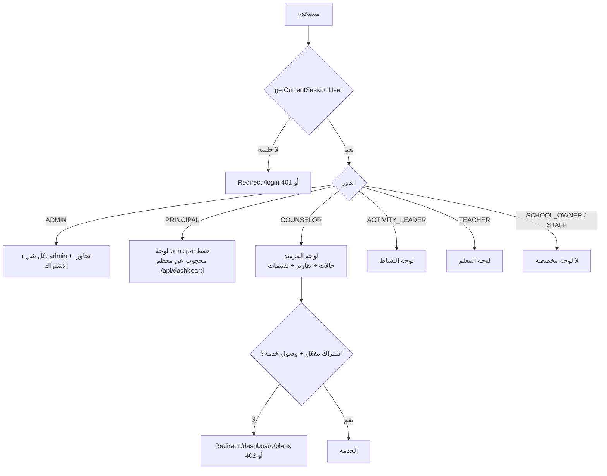

# خريطة الصلاحيات — Permissions Map

خريطة عملية للصلاحيات كما تُفرض في الكود. المصادر: `lib/security/permissions.ts`، `lib/auth/dashboard-context.ts`، حراس الاشتراك.

## مخطط: هل يستطيع الدور الوصول؟

## أبرز الحراسات حسب الدور

| الوجهة | الحراسة |
|---|---|
| `/api/dashboard/*` عمومًا | `requireDashboardApiContext` — `PRINCIPAL` مرفوض (403) في الغالب |
| صفحات `/dashboard/principal/*` | `allowPrincipal` فقط |
| `app/api/dashboard/admin/*` | `lib/admin/admin-api-guard.ts` — `requireAdmin` |
| صفحات `app/dashboard/admin/*` | `lib/admin/admin-page-guard.ts` |
| الخدمات الإرشادية | `requireServiceAccessForCurrentUser` + فحص الاشتراك |
| استبيانات عامة | لا جلسة — `Survey.token` |
| مهمة نشاط | لا جلسة — `ActivityAssignment.token` |
| مكتبة مرجعية | `ADMIN` و`COUNSELOR` + اشتراك |
| رفع تقارير المعلم | بوابة المعلم عبر حسابه `TEACHER` |

## مصفوفة الدور→الصلاحيات (من `lib/security/permissions.ts`)

> هذه الطبقة قديمة لكنها ما زالت مستخدمة في بعض المسارات. التفاصيل الدقيقة لكل دور في الملف؛ هنا الملخص:

| الدور | الصلاحيات النموذجية |
|---|---|
| `ADMIN` | `*` (كامل) |
| `COUNSELOR` | `cases:create/read/update`, `reports:create/read`, `services:read` ... |
| `ACTIVITY_LEADER` | `activity:create/read`, `reports:create` ... |
| `TEACHER` | `assignments:submit`, `portfolio:create` ... |
| `PRINCIPAL` | `dashboard:read` فقط |
| `SCHOOL_OWNER`/`STAFF` | قيود ضيقة أو غير محددة |

> تحقق قبل تعديل أي شيء: بعض المسارات تستخدم `requireRole(...)` من `lib/security/guards.ts` وبعضها يفحص `user.role` يدويًا — لا توجد نقطة واحدة.

## الاشتراك والخدمة كـ "صلاحيات"

- `requireActiveSubscriptionForCurrentUser` — اشتراك قابل للاستخدام (`TRIAL`/`ACTIVE` وغير منتهٍ).
- `requireServiceAccessForCurrentUser` — إضافة فحص `isServiceAllowedForSchool` (خدمة ضمن الخطة أو `ServiceAccess.isEnabled`).
- `ADMIN` يتجاوز الاثنين.
- الرد عند الفشل: مسارات API تعيد 402 JSON (`@/bin/require-auth.ts`)، الصفحات توجّه إلى `/dashboard/plans?reason=...`.

## ملاحظات عن التناقضات (انظر `known-inconsistencies.md`)

- طبقتان متوازيتان للحراسة (H1).
- مصفوفة `permissions.ts` لا تعكس كل القيود الفعلية المعمول بها (هناك فحص مباشر بـ`role` في مكوّنات كثيرة).
